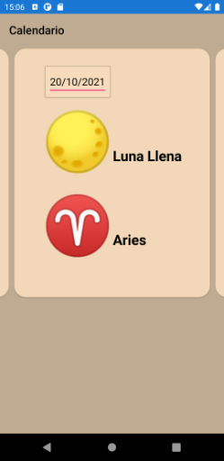
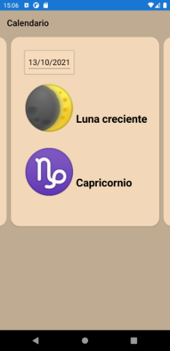
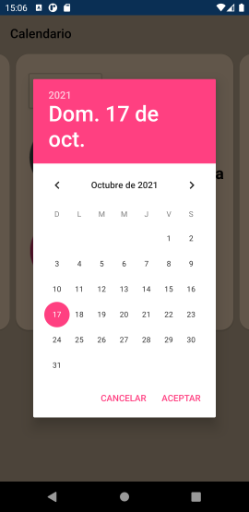
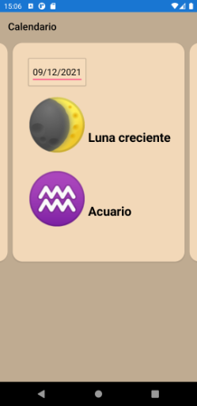
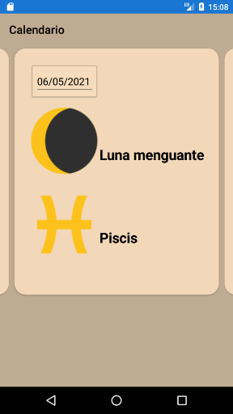
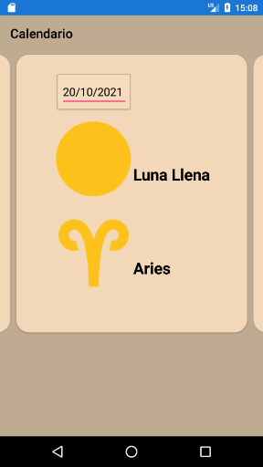
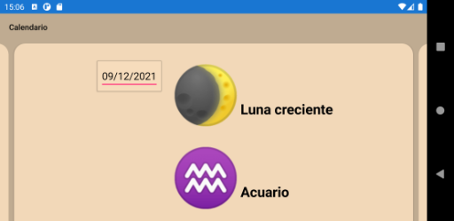
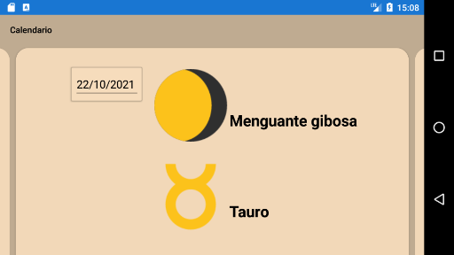

#  LunaZodiaco <!-- omit in toc -->

This cross platform - Linux, Mac OS X and Windows - F# .Net library and smartphone app calculates and shows the moon phase and the moon's zodiac at any date between the 1st of January 1900 and the 31st of December, 2099.

It calculates the ecliptic longitude of the moon (zodiac) using an algorithm from Paul Schlyter [Computing planetary positions - a tutorial with worked examples](http://stjarnhimlen.se/comp/tutorial.html) and the moon phase using the moon age calculations of [John Horton Conway](http://www.faqs.org/faqs/astronomy/faq/part3/section-15.html).

 It uses [Fabulous](https://fsprojects.github.io/Fabulous/Fabulous.XamarinForms/) as F# MVU (Elm-like) frontend to Xamarin.Forms.

For more information about calculations regarding the moon, see [Links](#links).

Information about the smartphone app is at [Usage of the Smartphone App](#usage-of-the-smartphone-app)

To interactively try out the F# NuGet package LunaZodiaco, go to the Jupyter Notebook

Full documentation can be found at [Read the Docs](https://LunaZodiaco.readthedocs.io/en/latest/)

[more badges ...](#badges)

## Table of Content <!-- omit in toc -->

- [Links](#links)
- [Download](#download)
- [Installation and Usage](#installation-and-usage)
  - [Android](#android)
  - [iOS](#ios)
  - [NuGet Package](#nuget-package)
  - [Usage of the Smartphone App](#usage-of-the-smartphone-app)
  - [LunaZodiaco NuGet Package](#lunazodiaco-nuget-package)
    - [Install Package & Basic Usage](#install-package--basic-usage)
- [Contributing](#contributing)
- [License](#license)
- [Privacy Policy](#privacy-policy)
- [Badges](#badges)
  - [Code coverage](#code-coverage)
  - [GitHub Actions/Workflows](#github-actionsworkflows)

## Links

Computing planetary positions - a tutorial with worked examples by [Paul Schlyter](http://stjarnhimlen.se/comp/tutorial.html)

Moon age (phase) calculation by [John Horton Conway](http://www.faqs.org/faqs/astronomy/faq/part3/section-15.html).

Link to a site with the [current data of the moon](http://time.unitarium.com/moon/where.html).

## Download

List of changes: [CHANGELOG.md](https://github.com/Release-Candidate/LunaZodiaco/blob/main/CHANGELOG.md)

[Link to the latest release](https://github.com/Release-Candidate/LunaZodiaco/releases/latest)

## Installation and Usage

Download the latest release: [Release at GitHub](https://github.com/Release-Candidate/LunaZodiaco/releases/latest)

### Android

Install the package for your smartphone (.apk for Android) onto your phone - search the web on how you can do that, this depends on your phone

### iOS

I can’t generate an iPhone package myself, so you have to build the project IOS for yourself and provision the app to your phone. Microsoft has a how-to [here](https://docs.microsoft.com/en-us/xamarin/ios/get-started/installation/device-provisioning/free-provisioning?tabs=macos)

### NuGet Package

Download an install the LunaZodiaco Nuget package using your IDE (Visual Studio or JetBrains Rider) or one of the command-line possibilities: [LunaZodiaco Package at NuGet](https://www.nuget.org/packages/LunaZodiaco/)

In an interactive F# FSI session, you can use the command #r "nuget: LunaZodiaco" to download and use the NuGet package LunaZodiaco.

### Usage of the Smartphone App

See [YouTube video of the smartphone app](https://youtu.be/j867_PNlodE) for a video.

### LunaZodiaco NuGet Package

#### Install Package & Basic Usage

## Contributing

Any help is welcome!

If you encounter a problem using LunaZodiaco, a task it not as easy as you'd like it to be or you'd like something added to it: open an issue at GitHub, see section [Report Issues](#report-issues-bugs-and-feature-requests).

See page [Contributing](https://LunaZodiaco.readthedocs.io/en/latest/contributing/) at Read the Docs for a detailed description.

## License

All content except some images of LunaZodiaco is licensed under the MIT license, see file [LICENSE](https://github.com/Release-Candidate/LunaZodiaco/blob/main/LICENSE).

## Privacy Policy

LunaZodiaco does not collect or share any personal information, it does not contain any ads, trackers or in-app-payments. See: [Privacy Policy](https://github.com/Release-Candidate/LunaZodiaco/blob/main/privacy_policy.md)

## Badges

### Code coverage

### GitHub Actions/Workflows

